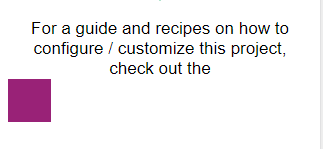
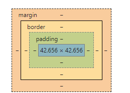
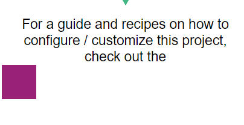
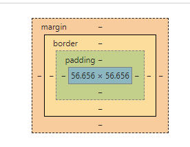
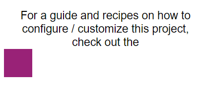
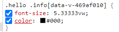

## vh/vm在不同尺寸的移动设备的适应显示

标题有点绕，但不影响要讲的内容，首先来回顾一下之前的`flexible`相关知识及目的

* 移动设备的屏幕有多个尺寸的大小，小到如同`iphone5`的4寸小屏（320宽的独立像素）也有`iphonex`的5.5寸大屏（414宽的独立像素retina屏）
* 为了适应不同的屏幕尺寸，`w3cplus`推出了`flexible`来解决页面在不同尺寸屏幕上的显示（以及不同像素点）
* 这不仅让同一个设计稿的页面在小尺寸上的显示能**完全显示**，也能在大尺寸屏幕上**放大显示**以至于不会~~空荡荡~~
* 而且在应对`retina`屏幕时（视网膜超高清显示）能最大限度地使用到屏幕的极限，以呈现出最优的显示效果

#### Flexible是如何做到的？

* 使用`rem`单位，`rem`单位是根据**根元素**的`font-size`来计算最终的`px`值的单位，比如，设置`html`根元素`font-size`为`100px`时
* 设置`div:width:1rem`，则实际计算得`div:width:100px`
* 利用这个特性，可以在大、小尺寸的屏幕上统一使用一个`rem`单位，然后通过设置不同大小`html:font-size:N px`，就能实现显示不同大小的元素

#### 那retina屏幕是怎么适配的？

* `retina`屏是指在固定的**设备独立像素**中使用更多的**物理像素**，比如，同样的5寸大屏，
* A机器的**设备独立像素**与B机器相当，均为**375px**
* 但由于B机器是`retina`屏幕，在它有限的5寸大屏中放了**375px x 2**的**物理像素**，所以理论上，同一个页面放到两个机器上都能正常显示
* 只不过没有发挥到B机器`retina`屏幕的优势，而`flexible`插件正是使用了以下方式，利用缩小页面的方式，使得每个**物理像素**都能得到一个
* 渲染的**Css像素点**，才完成了高清显示的效果

```html
<meta name="viewport" content="initial-scale=0.5, maximum-scale=0.5, minimum-scale=0.5, user-scalable=no">
```

#### 那图片怎么办？

* 通过上面的解释，当在`retina`屏幕时，将`font-size``width/height`等单位通过放大再缩小的原理，就能得到**高清呈现**但是图片怎么办？
* 图片可以使用`@2x`的方式，简单地说，就是使用两张不同尺寸的图片，根据`dpr`来计算何时使用哪张图片
* 而除了图片，我们对`font-size`等的建议是不使用`rem`单位
```css
@media (-webkit-min-device-pixel-ratio: 2), (min-device-pixel-ratio: 2) {
  background-image: url($url + "@2x.png");
}
```

#### 计算单位太麻烦了

* 实际上无论是使用`webpack``grunt``browsify`等任何打包工具，都有适合的工具来完成这样的工作
* 使用 `sass`的同学，可以使用`sass宏 @mixin / @function` 等工具

## vh/vw 计算不同移动端适配

* w3c关于`vw`进行布局: [https://www.w3cplus.com/css/vw-for-layout.html?a=b](https://www.w3cplus.com/css/vw-for-layout.html?a=b)
* [https://www.jianshu.com/p/1f1b23f8348f](https://www.jianshu.com/p/1f1b23f8348f)
* 铺垫了那么多，我们来探讨一下今天的主题：如何使用 `vw` 来做自适应单位的处理
* `vw`是`css3`的一个新的单位，`vw`基于当前浏览窗口的大小来计算`1vw`等于多少`px`值
* 我们知道，`flexible`本质上是动态改变`html`根元素的`font-size`大小，再根据每个元素的`rem`单位使用，来动态计算出`px`值
* 而使用`vw`，则天生支持`vw`到`px`的计算（无需引入`flexible`，无须动态必变根元素的`font-size`大小）
* 固如果能使用`vw`，则具备很多快捷方便的因素，在书写相关的`webpack`等打包插件时代码也比较简单，如下两个内容的呈现：

```css
.info {
  font-size: 40vw*(100/750);
  color: #000;
}
.blk {
  width: 100vw*(100/750);
  height: 100vw*(100/750);
  background-color: #992277;
}
```






#### postcss-px-to-viewport的使用

* 上面的计算方法实在过于麻烦，利用`postcss`插件，我们可以简单的通过配置实现`vw`单位转换
* Github [https://github.com/evrone/postcss-px-to-viewport](https://github.com/evrone/postcss-px-to-viewport/blob/master/README_CN.md)
* `npm install postcss-px-to-viewport --save-dev`
* 在项目根目录下，新建`postcss.config.js`文件（基于`vue.cli3x`项目）
* 书写以下代码(根据相关规则进行删减)：

```js
module.exports = {
    plugins:{
        autoprefixer:{},
        "postcss-px-to-viewport":{
            viewportWidth:375,//视窗的宽度，对应的是我们设计稿的宽度
            viewportHeight:667,//视窗的高度，对应的是我们设计稿的高度
            unitPrecision:5,//制定‘px’转换为视窗单位的小数位数（很多时候无法整除）
            viewportUnit:'vw',//指定需要转换成的视窗单位，建议使用vw
            selectorBlackList:['ignore','tab-bar','tab-bar-item'],//指定不需要转换的类，
            minPixelValue:1,//小于或等于‘1px’不转换为视窗单位
            mediaQuery:false//允许在媒体查询中转换为‘px’
        },
    }
}
```





#### rpx的转换思路(有bug)

* 小程序的单位默认是以`750`设计稿+`375`屏幕独立像素去呈现页面的，固长期以来，小程序在页面的设计上没有什么争议之处
* 利于这一点，再加上`vw`计算方法，我们可以直接使用`rpx`来作为我们的尺寸单位，然后使用插件`postcss-rpx-to-viewport`进行
* `rpx=>vw`的转化，方法如下：
    * 使用`rpx`单位进行日常开发书写（保证设计稿`750px`）
